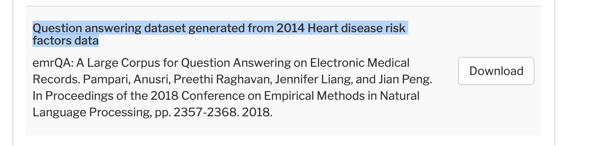

# emrQA: A Large Corpus for Question Answering on Electronic Medical Records
                  The page and codes are ready for use. We are excited to announce that this data
		   will now be hosted directly under the i2b2 license !! So you can directly
                   download the dataset from the i2b2 website instead of generating it from the scripts!
		   For downloading please refer to the instructions under the download tab below.                    
		   For later versions of emrqa and recent updates contact Preethi Raghavan (praghav@us.ibm.com).

- This repo contains code for the paper
Anusri Pampari, Preethi Raghavan, Jennifer Liang and Jian Peng,  
[emrQA: A Large Corpus for Question Answering on Electronic Medical Records][paper-link],  
In Conference on Empirical Methods in Natural Language Processing (EMNLP) 2018, Brussels, Belgium.
- General queries/thoughts have been addressed in the discussion section below.
- To automatically download emrQA from i2b2 instead of using the scripts to generate them follow instructions listed below.
- For later versions of emrQA  contact Preethi Raghavan (praghav@us.ibm.com). 
- Please contact [Anusri Pampari][anusri-home] (\<first-name\>@stanford.edu)  for suggestions and comments. More instructions about reporting bugs detailed below.

## Quick Links

- [About](#question-answering-on-electronic-medical-records)
- [Download Dataset](#download-dataset)
- [Requirements](#requirements)
- [Data Generation](#emrqa-generation)
- [Data Analysis](#emrqa-analysis)
- [Baselines](#baselines)
- [Discussion](#discussion)
- [Report a bug](#dataset-bugs)
- [Current works using emrQA](#current-works-using-emrqa)

##  Question Answering on Electronic Medical Records (EMR)

In this work, we address the lack of any publicly available EMR Question Answering (QA) corpus by creating a large-scale dataset, emrQA, using a novel semi-automated generation framework that allows for minimal expert involvement and re-purposes existing annotations available for other clinical NLP tasks. To briefly summarize the  generation process: (1) we collect questions from experts (2) convert them to templates by replacing entities with placeholders (3) expert annotate the templates with logical form templates and then (4) use annotations from existing NLP tasks (based on information in logical forms) to populate placeholders in templates and generate answers. For our purpose, we use existing  NLP task annotations  from the [i2b2 Challenge datasets][i2b2-datasets]. We refer the reader to the paper to get a more detailed overview of the generation framework.

This repository includes the question and logical form templates provided by our experts and the code for generating the emrQA dataset from these templates and the i2b2 challenge datasets. Note that this work is a refactored and extended version of the orginal dataset described in the paper.

Some statistics of the current version of the generated data:

| Datasets | QA pairs | QL pairs | #Clinical Notes | 
| :------: | :------: | :------: | :----: | 
| i2b2 relations (concepts, relations, assertions)| 1,322,789 | 1,008,205 | 425 |
| i2b2 medications | 226,128 | 190,169 | 261 |
| i2b2 heart disease risk | 49,897 | 35,777 | 119 |
| i2b2 smoking | 4,518 | 14 | 502 |
| i2b2 obesity | 354,503 | 336 | 1,118 |
| **emrQA (total)** | **1,957,835** | **1,225,369** | **2,425** |

**UPDATES:**
```
29th Novemebr 2018: We are excited to announce that this data will now be hosted directly under the i2b2 license !! So you can directly download the dataset from the i2b2 website instead of generating it from the scripts.
27th August 2018: Extended the i2b2 obesity question-answer pairs to obesity comorbidities. 
20th August 2018: Added QA pairs generated from i2b2 relations (assertions). 
27th Jun 2018: Dataset as decribed in the paper. 
```

## Download Dataset

emrQA is available for download here: https://portal.dbmi.hms.harvard.edu/projects/n2c2-nlp/ (you'll need to sign the agreement and request for the data, it comes through the same day). You'll find it listed under Community Annotations Downloads as follows - 



Please note that the download link title in the image has a typo. The link says that question answers were generated from 2014 Heart Disease risk factors data but it is generated from all the datasets listed in the table above (medications, smoking, obesity, heart disease and relations). So ignore the title and go ahead and downlaod the entire dataset from the link. i2b2/n2c2 will soon fix this typo.

## Requirements

To generate emrQA, first download the NLP Datasets from the [i2b2 Challenges][i2b2-datasets] accessible by everyone subject to a license agreement. You will need to download and extract all the datasets corresponding to given a challenge (e.g 2009 Medications Challenge) to a directory named `i2b2` in the main folder  (the contains of the folder location are eloborated below in the discussion section for your reference). Once completed, check the path location in `main.py`.  In our work, we have currently made use of all the challenge datasets except the 2012 Temporal Relations Challenge. Our future extensions of the dataset to include this challenge dataset  will soon be available. 

The generation scrpits in the repo require Python 2.7. Run the following commands to clone the repository and install the requirements for emrQA:

```bash
git clone https://github.com/emrqa/emrQA.git
cd emrQA; pip install -r requirements.txt
```


## emrQA Generation

Run `python main.py` to generate the question-answers pairs in a json format and the question-logical form pairs in a csv format. The input to these scripts is a csv file (`templates-all.csv`) located in `templates\` directory. By default the script creates an `output\` directory to store all the generated files. You can access the combined question-answer dataset as `data.json` and  question-logical form data as `data-ql.csv`. You can also access the intermediate datasets generated per every i2b2 challenge (e.g. `medications-qa.json` and `medication-ql.csv` generated from the 2009 medications challenge annotations). 


A thorough discussion of the output format of these files is presented below.

#### Input: Templates (CSV) Format

Each row in the csv file has the following format:

```
"dataset"  \t  "question templates"  \t  "logical form templates"  \t  "answer type" \t "sub-answer-type"
```

A brief explantion how following fields are used in `main.py`,

```
dataset: The i2b2 challenge dataset annotations to be used for the templates in that row. This field should be one of the following values, medications, relations, risk, smoking or obesity.
 
question templates: All the question paraphrase templates are provided as a string seperated by ##.

logical form templates: The logical form template expert annotated for the question templates.

answer type: The output type

sub-answer-type:
```
#### Output: Question-Answer (JSON) Format

The json files in `output\` directory have the following format:

```
data.json
├── "data"
   └── [i]
       ├── "paragraphs"
       │   └── [j]
       │       ├── "note_id": "clinical note id"
       │       ├── "context": "clinical note text"
       │       └── "qas"
       │           └── [k]
       │               ├── "answers"
       │               │   └── [l]
       │               │       ├── "answer_start"
       │               │       │             └── [m]
       │               │       │                 ├── integer (line number in clinical note to find the answer entity)
       │               │       │                 └── integer (token position in line to find the answer entity)
       │               │       │ 
       │               │       ├──"text": "answer entity"
       │               │       │
       │               │       ├──"evidence": "evidence line to support the answer entity "
       │               │       │
       │               │       ├──"answer_entity_type": takes the value "single" or "empty" or "complex" (refer to discussion for more details)
       │               │       │
       │               │       └── "evidence_start": integer (line number in clinical note to find the evidence line) 
       │               │ 
       │               ├── "id" 
       │               │    └─ [n]
       │               │       ├──[o] 
       │               │       │  ├── "paraphrase question"
       │               │       │  └── "paraphrase question-template"
       │               │       │ 
       │               │       └── "logical-form-template"
       │               │ 
       │               └── "question"
       │                    └──[p]
       │                       └──"paraphrase question"
       │ 
       └── "title": "i2b2 challenge name"

```

<!---
To generate the data in the SQUAD format (input format for the [DrQA][drqa] baseline in the paper) run,

```bash
python generation/combine_data/squad_format.py --output_dir output/

```
-->

#### Output: Question-Logical Form (CSV) Format

Each row in the csv file has the following format,

```
"question"  \t  "logical-form"  \t  "question-template"  \t  "logical-form-template"
```

## emrQA Analysis

#### Basic statistics

To run the scripts that finds the basic statistics of the dataset, such as average question length etc, do.

```bash
python evaluation/basic-stats.py --output_dir output/
```

#### Paraphrase analysis

To run the scripts that finds (1) the average number of paraphrase templates (2) Jaccard and BLEU Score of parapharase templates

```bash
python evaluation/paraphrase-analysis --templates_dir templates/
```

#### Logical form template analysis

To run the scripts that filter logical form templates with specific properties,

```bash
python evaluation/template-analysis.py --templates_dir templates/
```
## Discussion

##### What is the "answer_entity_type" field for ?

The "answer_entity_type" field in `data.json` takes the following values,

1) "empty": This indicates that the "text" field is an empty string, which means that there is no specific entity to look for in the evidence line.

2) "single": This indicates that the "text" field contains a single entity that can be found in the evidence line and can answer the question byitself.

3) "complex": This indicates that each "text" field is a list of entities. This means that each answer needs all the entities in this list to give a single answer. Here the evidence lines and answer_start (line start and token start) are all lists corresponding to the entity. 

#####  Why do I see “coronary artery” instead of  “coronary artery disease” in the question? Why is the entity used in question not complete ?

We have a preprocessing step, before using the i2b2 annotation in the question. This is because the annotation itself are noisy and can include generic concepts within the annotations.

For example,

Minor disease, her disease, her dominant CAD - these are all annotated as problems. So we remove/clean them  using a pre-processing step using some rules which checks for generic words in the annotation. As a result of this we are getting "coronary artery" instead of "coronary artery disease".

##### How is the "context" field related to the clinical notes text ?

In i2b2 medications, i2b2 relations, i2b2 smoking and i2b2 obesity challenge every patient has a single clinical note which is directly used in the "context" field. 

For i2b2 heart disease risk dataset we have 4/5 longitudnal clinical notes per patient named as follows, "note_id-01.txt", "note_id-02.txt"..."note_id-05.txt". Each of these files correspond to notes on a particular day and are already in timeline order. 
We combine all these ".txt" files (in the order given) seperated by "\n" and use them in the "context" field. The note_id part of the file name is used in "note_id" field. If you wish to break them down into individual notes, you can refer to the "note_id" field and in reverse find the note_id-01.txt, note_id-02.txt contents in the "context" field. 

##### i2b2 smoking and i2b2 obesity challenge generted QA are different. How ?

For the QA pairs generated from these datasets we do not have an evidence, neither do have a specific entity to look for. Instead the "text" field here is the class information provided in these two challenges and the entire "context" field can be seen as evidence. Please refer to the corresponding challenges for more information about the classes. 

##### The answer evidence is not a complete sentence. Why ?

The annotations used from the i2b2 datasets (except heart disease risk) have both token span and line number annotations. Clinical notes in these datasets are split at the newline character and assigned a line number. Our evidence line is simply the line in the clinical note corresponsing to a particular i2b2 annotation's line number. Since i2b2 heart disease risk annotations has only token span annotations without any  line number annotations, we break the clinical notes at newline character and the line containing the token span is considered as our evidence line. 
 
- When clinical notes are split at newline character, start/stop of the evidence line may not overlap with a complete sentence in a clinical note. To avoid this we tried to use a sentence splitter instead of newline character to determine our evidence lines. But existing sentence splitter's such as NLTK sentence splitter do even worse in breaking a clinical notes sentence because of its noisy, ungrammatical structure.
- Clinical notes are noisy, so some of the evidence lines may not have complete context or may not be grammatically correct.

##### i2b2 datasets directory structure

The i2b2 challenge datasets used to generate the current emrQA version was downloaded in August, 2017. Since the structure of these i2b2 datasets itself could change, we thought it might be useful to discuss our i2b2  repository structure. 

The scipts in this repository are used to parse the following i2b2 directory structure,

```

├── "i2b2 (download the datsets in single folder)"
       ├── "smoking" (download 2006 smoking challenge datasets here)
       │       │ 
       │       ├── "smokers_surrogate_test_all_groundtruth_version2.xml"
       │       └── "smokers_surrogate_train_all_version2.xml"
       │ 
       ├── "obesity" (download 2008 obesity challenge datasets here)
       │       │ 
       │       ├── "obesity_standoff_annotations_test.xml"
       │       ├── "obesity_standoff_annotations_training.xml"
       │       ├── "obesity_patient_records_test.xml"
       │       └── "obesity_patient_records_training.xml"
       │       
       ├── "medication" (download 2009 medication challenge datasets here)
       │       │ 
       │       ├── "train.test.released.8.17.09/" (folder containing all clinical notes)
       │       ├── "annotations_ground_truth/converted.noduplicates.sorted/" (folder path with medication annotations
       │       └── "training.ground.truth/" (folder path with medication annotations)
       │       
       ├── "relations" (download 2010 relation challenge datasets here)
       │       │ 
       │       ├── "concept_assertion_relation_training_data/partners/txt/" (folder path containing clinical notes)
       │       ├── "concept_assertion_relation_training_data/beth/txt/" (folder path containing clinical notes)
       │       ├── "test_data/txt/" (folder path containing clinical notes)
       │       ├── "concept_assertion_relation_training_data/partners/rel/" (folder path with relation annotations)
       │       ├── "concept_assertion_relation_training_data/beth/rel/" (folder path with relation annotations)
       │       ├── "test_data/rel/" (folder path with relation annotations)
       │       ├── "concept_assertion_relation_training_data/partners/ast/" (folder path with assertion annotations)
       │       ├── "concept_assertion_relation_training_data/beth/ast/" (folder path with assertion annotations)
       │       └── "test_data/ast/" (folder path with assertion annotations)
       │       
       ├── "coreference" (download 2011 coreference challenge datasets here)
       │       │ 
       │       ├── "Beth_Train"  (folder with the following subfolders "chains", "concepts", "docs", "pairs")
       │       ├── "Partners_Train" (folder with the following subfolders "chains", "concepts", "docs", "pairs")
       │       └── "i2b2_Test" (folder with "i2b2_Beth_Test" and "i2b2_Partners_Test" containing "chains" and "concepts" subfolders)
       │       
       └── "heart-disease-risk" (download 2014 heart disease risk factprs challenge datasets here)
               │ 
               └── "training-RiskFactors-Complete-Set1/" (folder path with files containing annotations and clinical notes)
       

``` 


## Dataset Bugs

##### I see a bug in the dataset, What should I do ?

For later versions of emrQA and recent updates contact Preethi Raghavan (praghav@us.ibm.com).

Please contact [Anusri Pampari][anusri-home] (\<first-name\>@stanford.edu) for any bugs. The more details you provide me about the bug, the easier and hence quicker you will make it for me to debug it. You can help me with the following information:

```
i2b2 dataset name
example note_id, how many notes are affected by this bug if possible
is there a trend in the type of questions (particular question template) where this bug occurs
An example instance of the bug indetail.
```

Opening a public issue, might go against the i2b2 license agreement. So it is important you mail me the bug. Thank you for understanding. I will try my best to reply at the earliest.

## Current works using emrQA

For a full and updated list please refer to the entire list published [here][citation-list].

- [Neural Mask Generator: Learning to Generate Adaptive Word Maskings for Language Model Adaptation][NMG]
- [Improved Pretraining for Domain-specific Contextual Embedding Models][pretraining]
- [Calibrating Structured Output Predictors for Natural Language Processing][calibration]
- [Annotating and Characterizing Clinical Sentences with Explicit Why-QA Cues][why-qa]
- [Entity-Enriched Neural Models for Clinical Question Answering][entity]
- [Evaluation of Dataset Selection for Pre-Training and Fine-Tuning Transformer Language Models for Clinical Question Answering][eval]
- [CliniQG4QA: Generating Diverse Questions for Domain Adaptation of Clinical Question Answering][da]
- [How You Ask Matters: The Effect of Paraphrastic Questions to BERT Performance on a Clinical SQuAD Dataset][para1]
- [Advancing Seq2seq with Joint Paraphrase Learning][para2]
- [Clinical Reading Comprehension: A Thorough Analysis of the emrQA Dataset][crc] - Though this work provides interesting analysis on some sub-parts of emrQA, we have concerns regarding the dataset bias considered in their analysis resulting in the said conclusions. We think that the emrQA readers should be aware of this bias and hence we try to convey this through a letter posted [here][letter] for the readers.

[NMG]:https://arxiv.org/abs/2010.02705
[para1]:https://www.aclweb.org/anthology/2020.clinicalnlp-1.13.pdf
[para2]:https://www.aclweb.org/anthology/2020.clinicalnlp-1.30.pdf
[da]: https://arxiv.org/pdf/2010.16021.pdf
[eval]: https://www.aclweb.org/anthology/2020.lrec-1.679.pdf
[entity]: https://arxiv.org/abs/2005.06587
[why-qa]: https://www.aclweb.org/anthology/W19-1913.pdf
[letter]: https://docs.google.com/document/d/1IeOqKPy3qzUEvpuSMy0Tvg7rjfYoAkn1ueplC5RXjpA/edit?usp=sharing
[crc]: https://arxiv.org/abs/2005.00574
[pretraining]: https://arxiv.org/pdf/2004.02288.pdf
[calibration]: https://arxiv.org/pdf/2004.04361.pdf
[citation-list]: https://scholar.google.com/scholar?cites=14819103415098730167&as_sdt=2005&sciodt=0,5&hl=en
[i2b2-datasets]: https://www.i2b2.org/NLP/DataSets/
[anusri-home]: https://www.linkedin.com/in/anusri-pampari-594bb5126/
[drqa]: https://github.com/facebookresearch/DrQA
[paper-link]: http://aclweb.org/anthology/D18-1258


